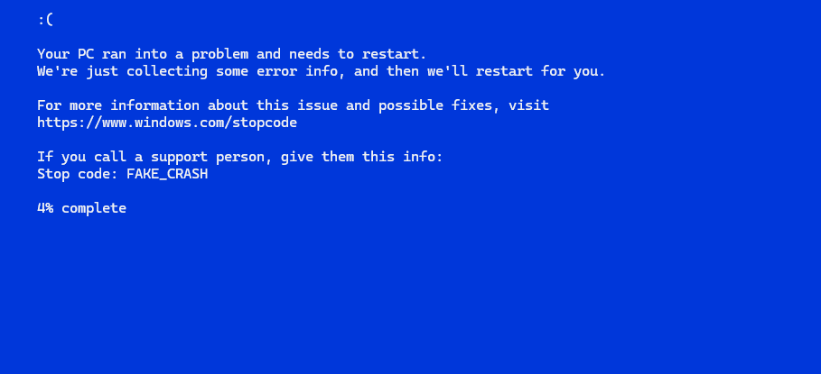

# 🟦 Fake Blue Screen of Death (BSOD) Prank

Simulate a terrifying Windows crash — without actually breaking anything.  
This harmless `.bat` file mimics the classic Blue Screen of Death in fullscreen, complete with a fake loading bar and sad face.

---

## 🧩 Features

- ✅ Windows 10/11 style fake BSOD
- 😢 Classic `:(` sad face
- 📈 Realistic loading bar (1% → 100%)
- 🖥️ Console window resizes for "big font" feel
- 🖲️ Press `F11` to go fullscreen!
- ⛔ Doesn't close automatically — user must press a key (extra panic time)

---

## 🛠️ How to Use

1. Download or clone this repo  
2. Double click `fake_bluescreen.bat`
3. When prompted, **press `F11` for fullscreen**  
4. Watch and enjoy 😈

> This script is 100% safe and does **NOT** harm your system in any way.  
> But still, prank responsibly.

---

## ⚠️ Warning

> This is a **joke**. Don't use it to harass, scare, or stress people out.

You're responsible for how you use this. If someone throws their laptop across the room, that's on you.

---

## 🧪 Tech Details

- Written in **pure `.bat`** (Windows batch script)
- Simulates progress with `for /l` loop
- Uses `mode`, `color`, and `timeout` to adjust display and pacing
- No external dependencies

---

## 📁 File Structure

fake-bsod/
├── FAKE_BLUESCREEN.bat # Main prank script
└── README.md # You're reading this
